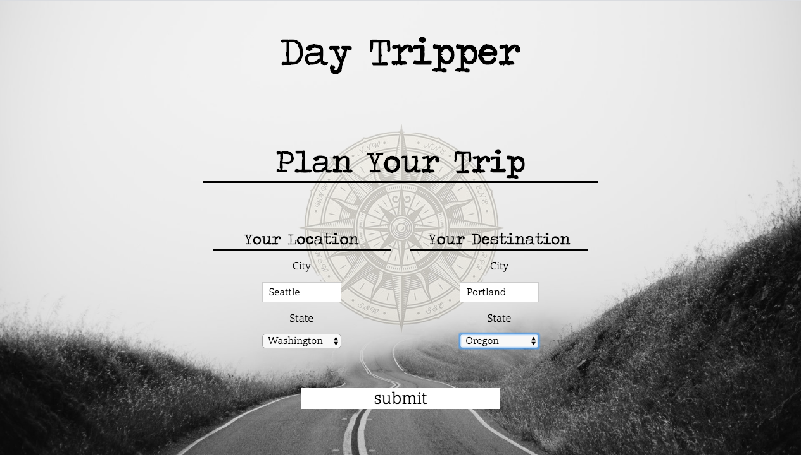
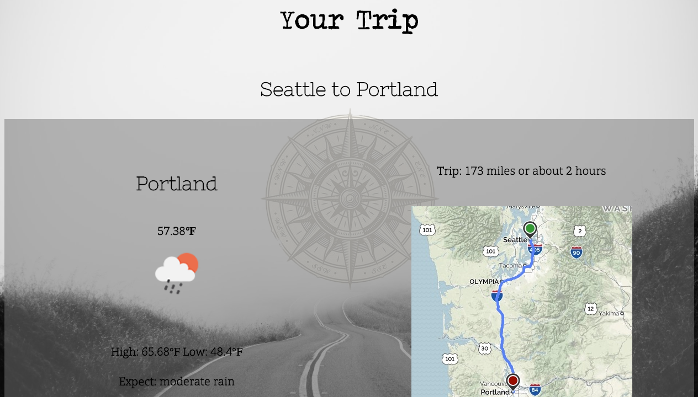
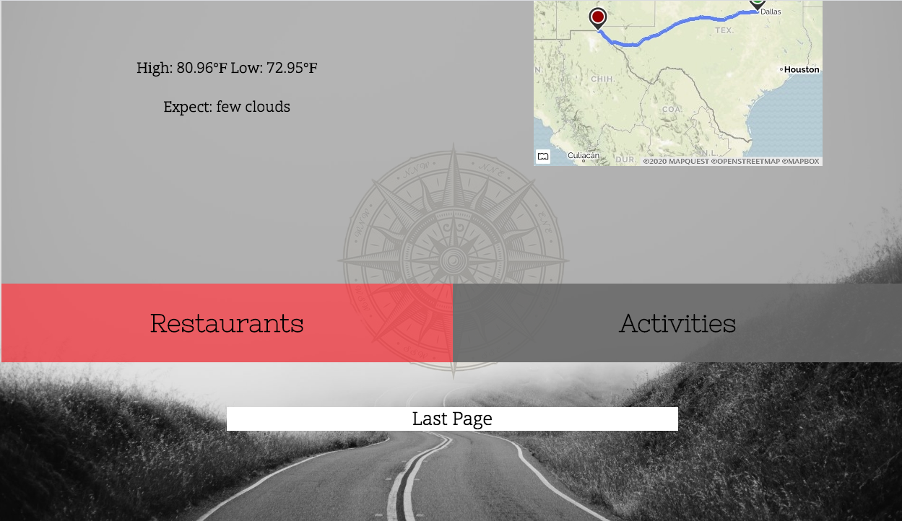

# <b>Day Tripper</b>

*This app requires the user to input city and state, and displays an itemized itinerary*
 
*that displays Weather, Route, Restaurants and Activities to the user.*

## Getting started

*Getting started is easy. Simply open the app, input your starting and ending locations,*
*and click submit...*

*Then the Itinerary screen displays, and shows the user the weather, route, restaurants and activities.*

*Should the user want to start over, the "Last Page" button will take them to the beginning.*

## Tech Used

*HTML, CSS, JS, jQuery, jQuery UI* 
*MapQuest API* 
*OpenWeatherMap API* 
*Zomato API* 
*FourSquare API*

## Team DayTripper
* Michaela Bateman 
* Jerrad Moon*
